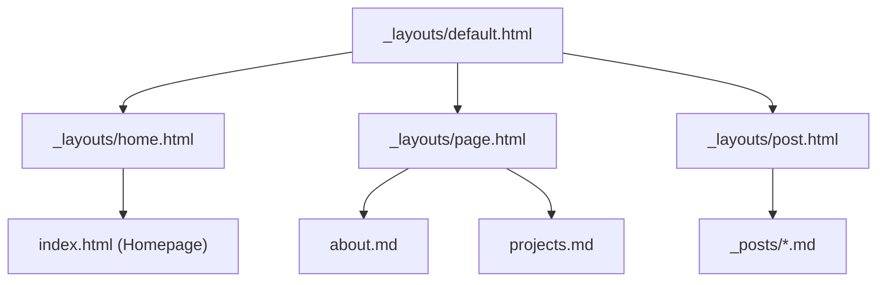

# Project Structure Documentation

This document provides a comprehensive guide to the directory organization, component architecture, layout system, and asset pipeline for this Jekyll website.

---

## 📂 Directory Tree Overview

```text
blog/
├── .github/
│   └── workflows/
│       └── deploy.yml          # GitHub Actions automated build & deployment workflow
├── _includes/                  # Reusable Liquid template components
│   ├── footer.html             # Site footer with social links & copyright info
│   ├── head.html               # HTML <head> with SEO tags, GA4 tracking & asset links
│   └── header.html             # Sticky glassmorphic navigation header
├── _layouts/                   # Jekyll page & post layouts
│   ├── default.html            # Core HTML shell (includes head, header, main, footer)
│   ├── home.html               # Landing page layout (hero section + post grid)
│   ├── page.html               # Standard content page layout (About, Projects)
│   └── post.html               # Blog article detail layout (read time, metadata, body)
├── _posts/                     # Blog post Markdown content (YYYY-MM-DD-title.md)
│   ├── 2026-07-20-future-of-web-architecture-2026.md
│   ├── 2026-08-01-mastering-jekyll-and-github-pages.md
│   └── 2026-08-15-building-scalable-ai-agents.md
├── assets/                     # Static website assets
│   ├── css/
│   │   └── style.css           # Glassmorphism dark theme CSS & design tokens
│   ├── images/
│   │   ├── avatar.jpg          # Profile avatar image
│   │   └── hero.jpg            # Hero banner background graphic
│   └── js/
│       └── main.js             # Interactive scripts (copy code button, read time)
├── .gitignore                  # Git ignore rules for Jekyll build outputs & caches
├── _config.yml                 # Jekyll global configuration & GA4 analytics ID
├── about.md                    # About Me page content (/about/)
├── ANALYTICS_SETUP.md          # Step-by-step Google Analytics 4 configuration guide
├── Gemfile                     # Ruby dependencies declaration
├── Gemfile.lock                # Locked dependency versions
├── index.html                  # Root homepage entry point (uses home layout)
├── PROJECT_STRUCTURE.md        # Comprehensive structure documentation
├── projects.md                 # Featured Projects portfolio page (/projects/)
└── README.md                   # Quick start and GitHub deployment guide
```

---

## 🛠 Detailed Component Breakdown

### 1. Configuration & Dependencies

| File | Description | Key Settings / Notes |
| :--- | :--- | :--- |
| [`_config.yml`](file:///D:/cv/blog/_config.yml) | Global Jekyll configuration | Configures `title`, `author`, `email`, `baseurl: "/blog"`, `google_analytics`, Markdown parser (`kramdown`), syntax highlighter (`rouge`), and default layout rules. |
| [`Gemfile`](file:///D:/cv/blog/Gemfile) | Ruby Gem definitions | Specifies `jekyll 4.4.1`, `webrick`, and plugin gems (`jekyll-feed`, `jekyll-seo-tag`, `jekyll-sitemap`). |
| [`.github/workflows/deploy.yml`](file:///D:/cv/blog/.github/workflows/deploy.yml) | CI/CD Pipeline | Automates building Jekyll with `bundle exec jekyll build` and deploying static outputs to GitHub Pages upon pushing to `main`. |
| [`ANALYTICS_SETUP.md`](file:///D:/cv/blog/ANALYTICS_SETUP.md) | Analytics Documentation | Instructions for creating a GA4 data stream and setting up tracking. |

---

### 2. Layout Hierarchy (`_layouts/`)

Jekyll builds pages by chaining layouts using `layout: <name>` front matter:



- **[`default.html`](file:///D:/cv/blog/_layouts/default.html)**: The master template. Wraps all pages with standard `<!DOCTYPE html>`, ``, ``, `<main>`, and ``.
- **[`home.html`](file:///D:/cv/blog/_layouts/home.html)**: Inherits from `default`. Renders the hero card with author bio/avatar and loops through `site.posts` to render responsive card grids.
- **[`post.html`](file:///D:/cv/blog/_layouts/post.html)**: Inherits from `default`. Displays article metadata (category badge, publish date, calculated reading time) and wraps body content in `.article-body`.
- **[`page.html`](file:///D:/cv/blog/_layouts/page.html)**: Inherits from `default`. Standard centered content layout used for static content pages.

---

### 3. Partial Includes (`_includes/`)

- **[`head.html`](file:///D:/cv/blog/_includes/head.html)**: Sets up document metadata, viewport scaling, SEO tags, OpenGraph tags, Google Analytics 4 tracking script (when `google_analytics` is set), Google Fonts (`Outfit` and `Inter`), and links `style.css` and `main.js`.
- **[`header.html`](file:///D:/cv/blog/_includes/header.html)**: Renders the sticky top navigation header with backdrop blur and active navigation link indicators.
- **[`footer.html`](file:///D:/cv/blog/_includes/footer.html)**: Renders copyright information, Jekyll/GitHub Pages credits, and social/email links.

---

### 4. Asset Pipeline (`assets/`)

- **[`assets/css/style.css`](file:///D:/cv/blog/assets/css/style.css)**:
  - Custom CSS variables for colors, glows, cards, typography, and glassmorphic borders.
  - Backdrop blur effects (`backdrop-filter: blur(16px)`).
  - Flexbox and CSS Grid responsive layouts.
  - Custom styling for code blocks, badges, hero cards, and post grids.
- **[`assets/js/main.js`](file:///D:/cv/blog/assets/js/main.js)**:
  - **Copy Code Button**: Automatically injects a copy button into `<pre>` code snippets.
  - **Reading Time Estimator**: Dynamically calculates and displays word count read time for articles.
- **[`assets/images/`](file:///D:/cv/blog/assets/images/)**: Contains graphics like profile pictures (`avatar.jpg`) and background hero banners (`hero.jpg`).

---

### 5. Content Management (`_posts/` & Root Pages)

#### Adding a New Blog Post
Create a file in `_posts/` following the strict naming convention `YYYY-MM-DD-title-slug.md`:

```markdown
---
layout: post
title: "Your Article Title"
category: "Category Name"
author: "Ly Duc Anh"
date: 2026-08-20 10:00:00 +0700
subtitle: "A short summary of the article."
---

Write your Markdown content here...
```

#### Adding a New Static Page
Create a Markdown file in the root directory (e.g. `services.md`):

```markdown
---
layout: page
title: "Our Services"
permalink: /services/
subtitle: "What we offer."
---

Content goes here...
```
